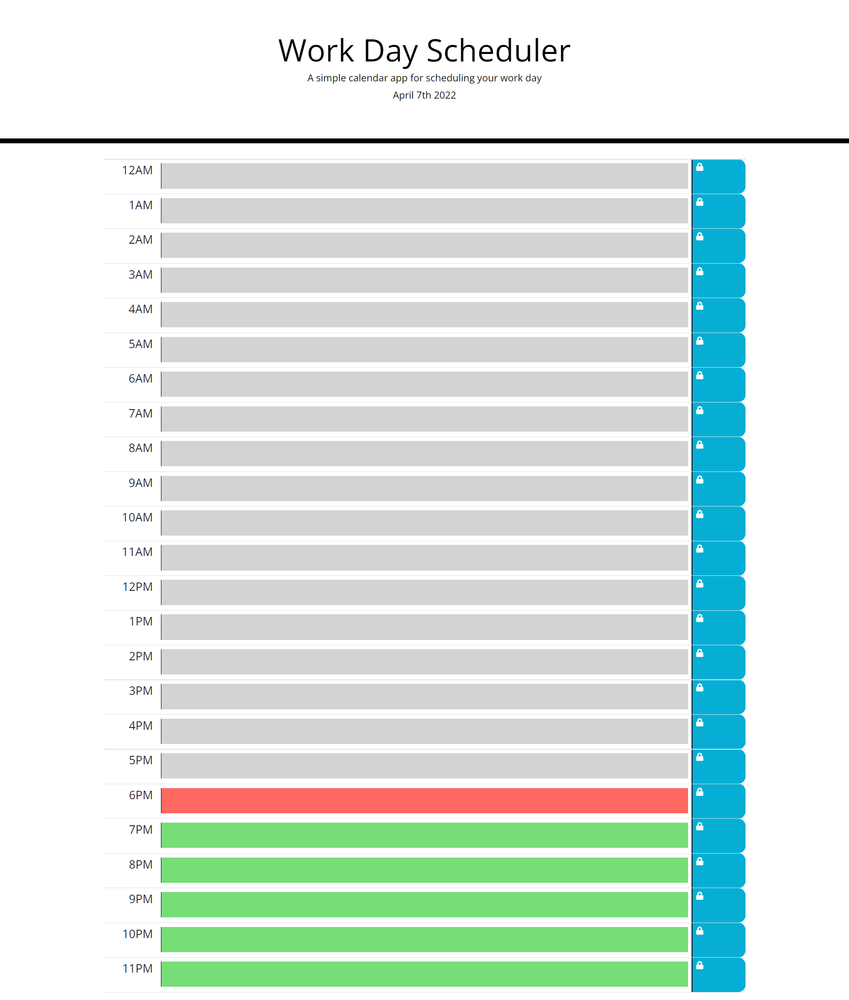

# 05-Third-Party-Apis-Work-Day-Scheduler

## Description 

The purpose of this program is to simulate the functionality of a work day scheduler. To the left is the different hours of the day defined by Am and Pm. In the middle is a text box that one could use to type in a certain activity during that time slot. To the right is a save box used to save your activity for the specified timeslot. The times, text boxes, and icons are dynamically generated. Moment.js was also used in this program.

## Mock-Up

The following image shows a demonstration of what the finished web application's presentation and functionality will include:

## Prerequisites

Before you continue, make sure you have the following requirements:

- You have Visual Studio Code downloaded.
- You are using a MAC OS or Windows machine.
- You have a basic understanding of HTML and CSS.
- You have a basic understanding of JavaScript.
- You have a basic understanding of web api's.

## Links

[This is a URL link to the deployed application.](https://bungycode.github.io/05-Third-Party-APIs-Work-Day-Scheduler/)

[This is a URL link to the github repository](https://github.com/Bungycode/05-Third-Party-APIs-Work-Day-Scheduler)